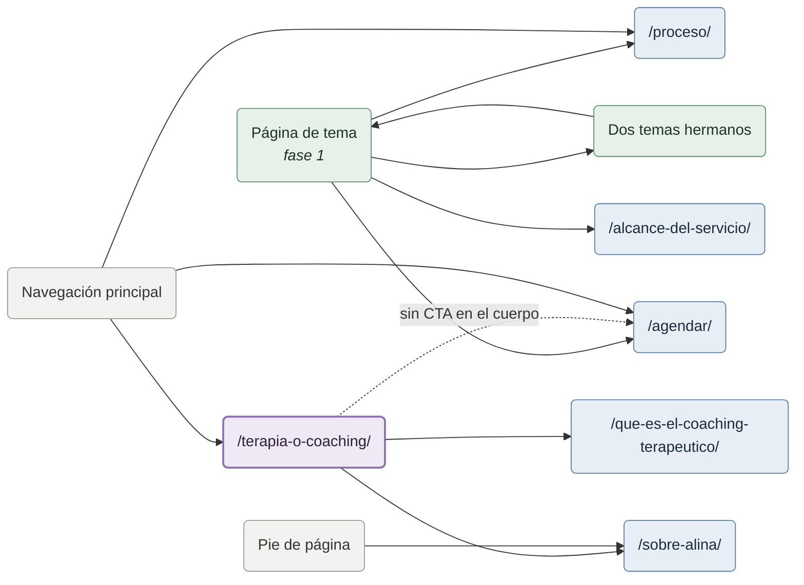

# Mapa de sitio

Esquema visual de `etapa-01-arquitectura.md`. Si los dos documentos discrepan, manda el de arquitectura.

## Jerarquía

```mermaid
graph TD
    HOME("<b>/</b><br/>Home")

    HOME --> QUE("<b>/que-es-el-coaching-terapeutico/</b><br/>Definición y alcance")
    HOME --> ENF("<b>/terapia-o-coaching/</b><br/>Comparativa de enfoques<br/><i>activo GEO</i>")
    HOME --> PROC("<b>/proceso/</b><br/>Las cuatro fases")
    HOME --> TEMAS("<b>/temas/</b><br/>Índice")
    HOME --> SOBRE("<b>/sobre-alina/</b><br/>Autoría y credenciales")
    HOME --> FAQ("<b>/preguntas-frecuentes/</b>")
    HOME --> AGENDAR("<b>/agendar/</b><br/>Conversión")

    PROC --> PRIMERA("<b>/proceso/primera-sesion/</b>")

    TEMAS --> T1("<b>/autoexigencia-y-perfeccionismo/</b><br/>590 · 2,400 — KD 17 · 26")
    TEMAS --> T2("<b>/sobrepensar-y-rumiacion/</b><br/>2,400 · 4,400 — KD 22 · 41")
    TEMAS --> T3("<b>/procrastinacion-y-evitacion/</b><br/>880 · 3,600 — KD 28 · 53")
    TEMAS --> T4("<b>/limites-y-relaciones/</b><br/>170 · 260 — KD 14 · 27")
    TEMAS --> T5("<b>/decisiones-y-cambios/</b><br/>sin término de cabeza")
    TEMAS --> T6("<b>/regulacion-emocional/</b><br/>1,600 — KD 31")

    HOME --> LEG("<b>Legales y confianza</b>")
    LEG --> L1("/alcance-del-servicio/")
    LEG --> L2("/aviso-de-privacidad/")
    LEG --> L3("/terminos-y-condiciones/")

    TEMAS -.-> ART("<b>/articulos/</b><br/>reservado, no se construye")

    classDef nucleo fill:#e8eef6,stroke:#5b7ea6,stroke-width:1px,color:#1c2b3a
    classDef geo fill:#efe9f5,stroke:#8b6fae,stroke-width:2px,color:#2b1f3a
    classDef fase1 fill:#e7f1ea,stroke:#5f9070,stroke-width:1px,color:#1d3326
    classDef fase2 fill:#fbf7e8,stroke:#b39a4e,stroke-width:1px,color:#3a3018
    classDef legal fill:#f2f2f0,stroke:#9a9a94,stroke-width:1px,color:#33332f
    classDef reservado fill:#fafafa,stroke:#c4c4c0,stroke-dasharray:4 3,color:#77776f

    class HOME,QUE,PROC,PRIMERA,TEMAS,SOBRE,FAQ,AGENDAR nucleo
    class ENF geo
    class T1,T2,T3 fase1
    class T4,T5,T6 fase2
    class LEG,L1,L2,L3 legal
    class ART reservado
```

**Verde:** se lanza en fase 1. **Amarillo:** fase 2. **Morado:** activo GEO. **Punteado:** reservado sin construir.

## Enlazado interno

`/terapia-o-coaching/` no lleva llamada a la acción en el cuerpo. Su valor GEO depende de que no se lea como venta; la conversión queda accesible desde la navegación.

`/sobre-alina/` recibe enlace desde el pie de todas las páginas. Es requisito de E-E-A-T que la autoría sea alcanzable desde cualquier punto del sitio.

## Navegación principal

`El proceso` · `Temas` · `Enfoques` · `Sobre Alina` · `Agendar`
